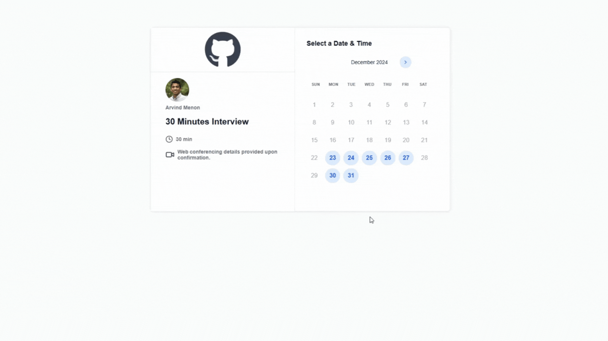
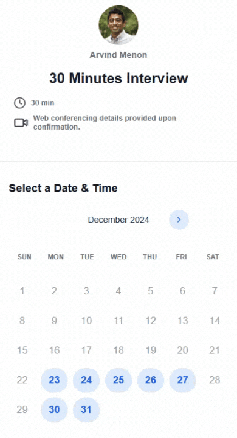

# Calender Appointment Application
This project is built using **Next.js** and is designed to fulfill a **Code Challenge**. The goal of the application is to create a simple interview scheduling system where users can book appointments. The project includes features such as a calendar interface, time slot selectors, forms for scheduling appointments, and custom components for better user interaction.


### Key Architectural Decisions:

- **Next.js:** Selected for its ability to handle server-side rendering, improving both performance and SEO, which is crucial for a fan-oriented website with public visibility.
- **TailwindCSS:** Chosen for a streamlined UI development experience, which helps developers maintain consistency across the application while allowing rapid adjustments to styles.
- **React Hook Form:** Helps manage forms efficiently, reducing the complexity of form validation and state management, ultimately resulting in cleaner, more maintainable code.
- **MVVM Pattern:**  
  - **Model:** Manages business logic and data.
  - **View:** React components that render the UI.
  - **ViewModel:** Connects the UI with business logic, handling the state and interactions.

## Project Organization

The project is organized with a folder structure that promotes separation of concerns and scalability:

- Contains the Next.js pages that make up the different routes of the application, such as the search page and the character detail view.
- Custom React hooks for reusable logic, like fetching data from the appointment API.
- Utility functions that help with common operations, including data transformations.
- Contains Tailwind CSS configuration for theme customization and custom styles.

The folder structure is designed to maintain scalability by modularizing different parts of the application. This makes it easier to add new features or extend current functionality without impacting other areas.

The development followed several best practices to ensure code quality:

- **TypeScript for Static Typing**: TypeScript was used to enhance maintainability and catch bugs during development.
- **Component-Driven Development**: The UI was developed as a set of small, independent components, making it easier to iterate.

## Features

- **Calendar View:** Displays available dates for scheduling appointments.
- **Time Slot Selector:** Allows users to choose a convenient time for their interview or meeting.
- **Form for Appointment Scheduling:** Users can enter their information and book an appointment.
- **Custom Buttons:** Styled buttons for various actions such as confirming or canceling appointments.
- **Responsive Design:** Ensures the application works seamlessly on different devices and screen sizes.
- **Dynamic Appointment Management:** Users can view and select available time slots, reducing the risk of double-booking.

## Folder Structure

This project uses a **feature-based organization** to ensure modularity and scalability. Here's the folder structure:

src/ 
 - app/ - Application-level configurations (e.g., Redux store). 
 - components/ - Shared reusable components. 
    - Avatar.tsx
    - Button.tsx Container.tsx 
 - const/ - Constants used across the application. 
 - features/ - Feature-specific modules. 
    - appointments/ 
       - components/ - Components specific to the appointments feature. 
       - screens/ - Screens like Appointment.tsx and Schedule.tsx. 
       - services/ - Services for API calls and business logic. hooks/ - Custom hooks specific to this feature. 
       - helpers/ - Utility functions for common operations. hooks/ - General-purpose hooks. lib/ - Libraries or integrations (e.g., API clients).

## Running the Application

### Install dependencies:

```
npm install

This will install all the required packages specified in `package.json`.
```
```
### Start the development server:

npm run dev

This command will start the application locally for development purposes.

```

## Preview Web and Mobile




## Lean and Scalable Development

The project was developed with a focus on lean and scalable practices. By using modern frameworks and reusable components, the codebase remains easy to maintain and extend. Server-side rendering (SSR) provided by Next.js helps keep the application fast, while static typing with TypeScript ensures a low rate of errors, contributing to both performance and quality.

